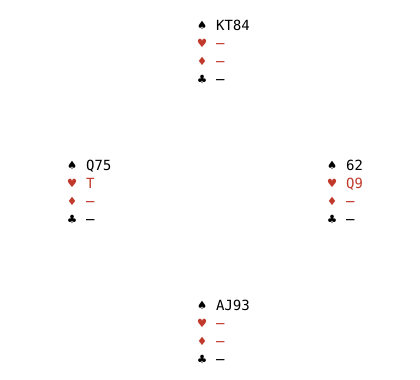

# Replenished Belief Evaluation

Declarer play bots typically use Perfect Information Monte Carlo (PIMC) to decide which card to play. The idea is to generate a set of layouts that are consistent with the bidding and play. This note outlines options for designing improved algorithms.

We will use the term belief space for the set of all layouts that we think are plausible. The name reflects that this is what declarer believes the actual layout could be, or must be — though declarer may of course have got it all wrong. Psychic bids and deceptive play to fool the opponents do happen, and are among the many reasons bridge is such a fascinating game. 

Declarer will typically consider only layouts in which the contract can be made. Playing for a layout other than the actual one can still be good play. 

The discussion in this note focuses on scenarios where making the contract is clearly the primary objective. We do not consider matchpoint scoring, or IMP situations where extra undertricks can be expensive.
## Declarer play plan definition
A declarer play plan is a decision strategy $\pi$ that prescribes which card to play when declarer or dummy is in turn given all available information. The defender's strategy will be denoted by $\delta$. Both defenders use the same strategy but feed different information into it to reach a decision. Strategies can be stochastic and $\pi\left(\cdot \mid a, b, c, \cdots \right)$ is the probability distribution. 

The set $\mathbf{C}$ are the cards yet to be played by the defenders, indexed by $a, b, c, \cdots$. The function $c_\pi\left(a,b,c, \cdots\right)$ returns the action prescribed by $\pi$ given the observed cards. It can happen that $c_\pi$ has to return two cards at a trick boundary. We use the computer science style notation $c_\pi\left(\right)$ for the first card to play. This note will is restricted to deterministic declarer play strategies, but defender strategies may be stochastic. $c_\pi$ will be deterministic only when $\pi$ is.

The notation $(a, b, c \cdots \mid \pi)$ will be used for observing defender cards $a, b, c \cdots$ given declarer follows $\pi$. Whether the first card is played by declarer or a defender follows from the problem. For a full hand it will always be a defender, but for a partial problem it might declarer or a defender. This notation is convenient as we don't have to write all declarer cards explicitly. The same side will, however, play two cards in a row at the end of each trick. This can be indicated by grouping cards: $(a, b,, c, (d,e), \cdots \mid \pi)$ and a double $,,$ indicates that declarer played two cards. As it happens we will not need to worry about this when deriving the results reported in this note.
## Describing a declarer play problem
Declarer play plans specify a sequence of actions that depend on what declarer observes. Declarer knows which cards the defenders could play next, but not which one they will play. Each card played by the opposition reduces the belief space. We write  $\mathbf{B}$ for the set of plausible layouts. A plain letter $B$ denotes an individual layout, indexed $i,j,k,\cdots$. We also need a probability distribution $P_\mathbf{B}$ over the possible layouts. The pair $\left\\{ \mathbf{C},  P_\mathbf{B} \right\\}$ describes the unknown part of the state completely since $P_{\mathbf{B}}$ has $\mathbf{B}$ as its explicit domain. The commonly known part of the state - the auction, player on lead, tricks won so far and cards played to the current trick - is identical in every layout of the belief space, and is suppressed from the notation. It still has to be carried forward to score the result.

Defenders are always adversarial, but  different defender models choose differently between cards. How this affects declarer's planning is discussed later, when we examine different defender models. Note that a defender can introduce a stochastic element by randomising the choice.

Declarer plays a card $c_\pi\left(\right)$ and then observes the card $C_a$ played by the defender in turn. This action induces a change

$$
\left \\{ \mathbf{C},  P_\mathbf{B} \right\\}\rightarrow \left\\{ \mathbf{C'}, P_\mathbf{B'} \right \\}
$$
 
The defender will play $C_a$ with probability $\delta \left(C_a \mid c_\pi\left(\right), B_i \right)$ computed from their belief space given the information they have in layout $B_i$. This is non-zero if and only if the defender in turn holds $C_a$  in $B_i$ and $C_a$ is an optimal play according to the defender model. The primed entities can be calculated as

$$
\begin{aligned}
\mathbf{C}' & = \mathbf{C} - \left \\{ C_a \right \\} \\
\mathbf{B}' & = \left \\{ B_i \in \mathbf{B}: \delta\left( C_a \mid c_\pi\left(\right), B_i \right) > 0 \right \\} \\
P_{\mathbf{B}'}\left ( B_i\right) &= \frac{\delta \left(C_a \mid c_\pi\left(\right), B_i \right) P_{\mathbf{B}}\left ( B_i\right)}{\delta \left(C_a \mid c_\pi\left(\right) \right)}
\end{aligned}
$$

Here $``\delta \left(C_a \mid c_\pi\left(\right) \right) = \sum_i{\delta \left(C_a \mid c_\pi\left(\right), B_i \right)P_{\mathbf{B}}\left ( B_i\right)}``$. Given a layout $B_i$, both declarer and defenders can deduce the contents of their opponents' $\mathbf{B}$, provided the inference rules and the defender model are common knowledge.This is the reason that declarer can calculate $\delta$. Most of the work in this note presumes perfect-information defenders, which collapses their belief space to $\left \\{ B_i \right \\}$. 

Declarer takes a series of decisions, each leading to a new state, but never knows the actual layout. Decision-making of this kind is known as a Partially Observable Markov Decision Process (POMDP). Converting to a belief space is the standard trick that turns a POMDP over hidden layouts into a belief MDP. Solving a POMDP is usually computationally intractable, but it is encouraging to be working within a class of problems that has an established literature.
## Recursive evaluation
Declarer plays a card $``c_\pi\left(a,b,c, \cdots\right)``$, observes the defender in turn play $C_d$, and now faces a decision in the new state $\left\\{ \mathbf{C'}, P_\mathbf{B'} \right\\}$. If this is the last trick — four cards left to play — the score can simply be totalled. Otherwise, by the Markov property, we feed $\left\\{ \mathbf{C'}, P_{\mathbf{B}'}\right\\}$ into the same algorithm we used for $\left\\{ \mathbf{C},P_\mathbf{B} \right\\}$.
## Inductive reasoning
Observing a card played by a defender narrows the belief space to the layouts in which that defender holds the card. Further deductions follow from the requirement that the defender considers the card optimal. Declarer might, for instance, rule out any layout in which the defender could instead have cashed a setting trick. Assuming the defender's choice was double-dummy optimal is a plausible approximation. Defender models are discussed in more detail below, once the algorithm for evaluating a declarer play plan has been developed.
## Searching for an optimal declarer play plan

Declarer wants to maximise the probability that the contract makes; the defenders want the opposite. Declarer does not know the actual layout, but assumes that a defender always plays an optimal card, and that it is common knowledge which cards count as optimal in a given layout.

Calculating the probability that the contract makes seems straightforward if, for each layout, we know the probability that it occurs and whether the contract makes with two fixed plans $\pi$ and $\delta$. Let $``\mathbf{W}_{\pi, \delta}``$ be the subset of layouts in which the contract makes under $\pi$ against $\delta$, and let the indicator $``\mathbf{I}_{i \in \mathbf{W}_{\pi, \delta}}``$ be one when $B_i$ lies in $``\mathbf{W}_{\pi, \delta}``$ and zero otherwise. Writing $p_i$ for the probability of layout $B_i$,

$$
P_{make}^{\left (\mid \pi \right)} = \sum_{i=1}^N p_{i}\, \mathbb{I}_{i \in \mathbf{W}_{\pi, \delta}}
$$

By construction of the belief space we take all layouts to be equally likely at the root node, so $p_i = 1/N$ and

$$
P_{make}^{\left (\mid \pi \right)} = { 1 \over N} \sum_{i=1}^N \mathbb{I}_{i \in \mathbf{W}_{\pi, \delta}}
$$

This indicates that our task is to identify at least one declarer play plan $\pi$ for which $``\mathbf{W}_{\pi, \delta}``$ is as large as possible. The defender strategy $\delta$ is fixed throughout and is suppressed from the notation everywhere except in $``\mathbf{W}_{\pi, \delta}``$, whose definition depends on it.

There is a subtle assumption about $\delta$ lurking here. The outcome must not change with the sequence in which defender cards are played. This will hold if $\delta$ is deterministic or randomises only between cards that are equivalent against $\pi$. Randomising between equivalent cards requires only local knowledge, and reduces declarer's ability to read the layout exactly. This restriction can be lifted, but doing so requires advanced probability theory. We will develop the algorithm for evaluating the probability that a declarer play plan makes using more accessible notation before strengthening the results.

Algorithms for searching for an optimal strategy are beyond the scope of this note. In what follows we focus on evaluating the probability that a given strategy $\pi$ succeeds.
## Aggregating probability to make the contract
Say that declarer's first observation is the defender in turn playing $C_a$. This reduces the belief space to the layouts in which the defender to play holds $C_a$, considers it optimal, and elects to play it. 

The updated probability of making the contract is

$$
P_{make}^{\left (a\mid \pi \right)} = { 1 \over N} \sum_{i=1}^{N} p^{\left ( a \mid \pi \right)}_i \mathbb{I}_{i \in \mathbf{W}_{\pi, \delta}}
$$

Here we use the shorthand notation $``p^{\left ( a \mid \pi \right)}_i = \delta \left(C_a \mid c_\pi\left(\right), B_i \right)``$ for the probability that the defender plays $C_a$ given that the layout is $B_i$. This probability is zero if the defender does not hold $C_a$ or the play is non-optimal according to the defender model, one if $C_a$ is the only optimal choice, and $1/\mu$ if there are $\mu$ optimal choices.

$P_{make}^{\left (a \mid \pi \right)}$ is therefore the joint probability that the defender plays $C_a$ and the contract makes. Playing a different card $C_b$ is a mutually exclusive observation, so we obtain the total probability by summing over every card the defender might play after declarer's first card:

$$
P^{\left ( \mid \pi \right)}_{make} = \sum_{a} P_{make}^{\left (a \mid \pi\right)}
$$

Renormalising weights after each observation is natural if we want to work with conditional probabilities, but it complicates the formula for aggregating probabilities. To keep clear which entity is meant we use $w_i^{\left(a,b,c,\cdots \mid \pi \right) }$ for the current weight and $p_i^{\left(a,b,c,\cdots \mid \pi \right) }$ for a probability.

$$
\begin{aligned}
p_i^{\left(a,b,c \mid \pi \right)} &= p_i^{\left (a\mid \pi \right)} \times p_i^{\left (b\mid a, \pi \right)} \times p_i^{\left (c\mid a,b, \pi \right)}\\
w_i^{\left (\mid \pi \right)} &= p_i = {{1}\over{N}}\\
w_i^{\left (a,b,c,\cdots\mid \pi \right)} &= w_i^{\left( \mid \pi \right)} \times p_i^{\left (a,b,c,\cdots\mid \pi \right)} \\
w_i^{\left (\cdots, b, c\mid \pi \right)} &= w_i^{\left (\cdots, b\mid \pi \right)} \times p^{\left ( c \mid \cdots,b,\pi \right)}_i
\end{aligned}
$$

Next we evaluate $P_{make}^{\left (a \mid \pi \right)}$ for a fixed $C_a$. Declarer's next observation $C_b$ gives the probability that the contract makes as

$$ 
P_{make}^{\left (a,b\mid \pi \right)} =  \sum_{i=1}^{N}  w^{\left ( a \mid \pi \right)}_i   p^{\left ( b \mid a,\pi \right)}_i \mathbb{I}_{i \in \mathbf{W}_{\pi, \delta}} = \sum_{i=1}^{N}w^{\left ( a, b \mid \pi \right)}_i \mathbb{I}_{i \in \mathbf{W}_{\pi, \delta}}
$$

We can again sum over every card the defender could have played which gives

$$
P^{\left ( a \mid \pi \right)}_{make} = \sum_{b} P_{make}^{\left (a, b \mid \pi\right)}
$$

This establishes a recursion that can be used to evaluate the probability that the contract makes given a fixed strategy $\pi$.

The sum $``\sum_{i=1}^{N}w_i^{\left ( a, b \mid \pi \right)} \mathbb{I}_{i \in \mathbf{W}_{\pi, \delta}}``$ can be shortened by including only $``w^{\left ( a, b \mid \pi \right)}_i > 0``$ terms. This is an important property, as it reduces the size of each recursive calculation. We also have the useful identities

$$
\begin{aligned}
\sum_a p_i^{\left (a \mid \pi \right)} &= 1 \\
\sum_c p^{\left ( c \mid \cdots,b,\pi \right)}_i &= 1\\
\sum_c w_i^{\left(\cdots, b, c \mid \pi \right)} &= w_i^{\left(\cdots, b \mid \pi \right)}
\end{aligned}
$$

## Defender models
The algorithms discussed in this note have been researched using perfect-information defender models. There is, as far as we know, no feasible algorithm for constructing a defender model that is optimal against $\pi$. Double-dummy defenders with heuristics, discussed below, are intended as a sufficient approximation.

A realistic defender model would be based on the defender's current belief about the cards held by partner and by declarer, refined by observing the actions of both, and by the partnership's agreements on leads and signals. Building such a model is a harder research task than modelling declarer play, and will have to wait until we know how to model declarer play.
### Double-dummy defenders with heuristics
Treating all cards that are double-dummy optimal as equivalent can be too pessimistic from a defender's point of view as it assumes declarer omniscience.

South is declaring and plays the ace of spades. Double-dummy analysis treats the queen, seven and five as equivalent, because it excludes the possibility that declarer guesses the suit incorrectly.

The research in this note uses double-dummy defenders with heuristics that select from a subset of double-dummy optimal cards to avoid the worst of these problems. The heuristics resemble "low in second seat", "high in third seat" and other defensive rules of thumb. When they are a good enough approximation of a perfect-information defender requires further research.

Note that these heuristics are not guaranteed to stay within the requirements for the $\mathbf{W}_{\pi,\delta}$ based formulation above. The advanced probability theory formulation is needed to demonstrate that the recursive algorithm is still sound.
### Scanning declarer's belief space
Perfect-information defenders have access to the current layout as well as the information available to declarer and can thus deduce declarer's belief space. They can also deduce declarer's optimal plan $\pi$ for each possible card and can thus choose the card that minimises declarer's number of tricks. They may, however, choose a play that concedes declarer a chance of overtricks in exchange for a greater probability that declarer misjudges the layout and fails to make the contract. Deceptive plays are discussed further below.

Perfect-information defenders that scan the belief space, and adapt to $\pi$, are not fixed throughout as is assumed in the rest of this note. This is not a problem for a fixed $\pi$ but would be fatal for the brute force search sketched below.

A subtle decision remains: whether to minimise declarer's tricks for the current layout or across the belief space. Both are approximations of what a realistic defender would do, and which of them makes the better adversarial model for building solid declarer-play algorithms requires further research.
### Deceptive plays
We shall define a deceptive play as an action that is expected, or even well known, to be non-optimal double-dummy on the actual layout but gains value from what declarer does next. This requires that the defenders are aware of $\pi$. Deceptive plays targeted at the actual $\pi$ are therefore inexpressible if $\delta$ is independent of $\pi$. Defenders may still carry out some deceptive plays, targeted at some fixed declarer play plan $\pi_0$ that is deemed likely to be close to the actual plan. 

A classic example arises in 4NT. West leads the queen of hearts and dummy appears with ♠T73 ♥8 ♦64 ♣AQJ9543. Declarer wins the heart ace and, needing the club suit, leads a small club from hand and calls for the queen.

East, sitting over dummy with ♣K7 doubleton, ducks smoothly, and the queen wins. Taking the king at once would have secured that trick; ducking risks it, since the king must fall under the ace on the second round. East is playing for declarer to hold two small clubs. That would leave two clubs outstanding after the first round, so declarer would have a genuine guess on the second — and on a lucky day would read the first round as a successful finesse, cross back to hand and finesse again, giving East's king a trick that was never coming.

That is what makes it a deceptive play: it is not double-dummy optimal on the actual layout, and gains only from what declarer chooses to do next. Here it gained nothing. Declarer was the author's old friend Peter Gregorsson, who held three small clubs. With ten clubs between the two hands, only one club remained outstanding once the queen had won, so he called for the ace and the bare king fell.

A partial-information defender will try a deceptive play whenever it is optimal against declarer's actual plan $\pi$, because it works in other layouts — whether or not it happens to work on the actual layout. Such a defender will never try a deceptive play when a standard play offers a higher probability of defeating the contract.

Opportunities to execute successful deceptive plays are in practice very rare. Existing declarer-play algorithms do not, to the author's knowledge, guard against them. It is thus reasonable to expect that we can construct declarer-play algorithms that beat the existing ones by optimising against defender models that exclude deceptive plays. These improved models would still be exploitable by defenders capable of deception, but since such opportunities are rare, the practical cost is small.

There is an asymmetry here that needs to be noted. Declarer may also choose to execute a deceptive play to boost the probability to make the contract, not worrying about extra undertricks. Declarer's deceptive plays can, however, never succeed against perfect-information defenders.
## Pruning the a priori belief space
Layouts that are already doomed before a single card is played can be removed, which reduces the cost of calculating the probability that the contract makes. This requires that the probability of the contract being doomed before declarer plays a card is known.

$$
P_{\text{make}} = P(\text{make} \mid \text{not doomed}) \times P(\text{not doomed})
$$

This formula holds because $P(make \mid doomed)$ is zero by definition. Formally this should be doomed given $\delta$, but any method which is guaranteed to only remove doomed layouts is acceptable. Doomed layouts would in any case be removed later in the search, when they are marked as lost.
## Early cuts
Against perfect-information defenders, declarer will never make the contract in a layout when the double-dummy result is enough to defeat it. Such layouts can be skipped completely.

Similarly, there is no need to continue searching a layout in which declarer is known to make the contract. Such layouts must be added in with their current weight.

Nodes at which it is known whether the contract makes can be evaluated immediately. 

The bound for when declarer is known to make the contract can be improved by adding a top-trick analyser. These early cuts speed up the search significantly.
## Sampling and replenishing
Searching the full belief space is infeasible for a full bridge deal, so we have to sample it.

Running the evaluation algorithm over a sample means the calculation might end prematurely, because the sample may contain only one layout consistent with the observed play. The sample can, however, be replenished between each defender move as each recursive search step can be evaluated locally and contains the entire history.

Sampling and replenishing requires that the weights are kept consistent. With a sample size of $M$ we change the prior at the root node to $w^{\left(\mid\pi\right)}=1/M$. 

Early cuts must not be evaluated at a node that is at or below the replenishment floor, since they would fire automatically at a node with only one layout left.

A layout $B_i$ survives when $``0 < p_i^{\left( a,b,c,\cdots \mid \pi\right)} \le 1``$. The probability is one only when the defenders have exactly one choice at each turn. A layout may be present in several nodes whenever the defenders have had more than one choice at least once.

We can think of the full belief space as a randomised array of all possible layouts, and of sampling as taking layouts from the front. To replenish, we search the array from the front until we find another $K$ layouts that match the played sequence and are not already part of the sample.

A possibly more efficient alternative is to enumerate the part of the belief space that has not already been included in the sample. This also lets the algorithm use the whole remaining belief space whenever that is small enough to be feasible.

The new layouts are added to the search tree only under the node at which we replenish. Each new layout $B_j$ has the probability  $p_j^{\left(a,b,c,\cdots \mid \pi \right)}$ that the defenders would have played the cards in this sequence.

Whether we resample or enumerate the remaining belief space, the total probability mass for the node must remain constant.  Since replenishing introduces different weights we will use a slight change of notation

$$
\begin{aligned}
\kappa^{\left( \mid \pi\right)} &= {1 \over M} \\
w_i^{\left(a,b,c,\cdots \mid \pi \right)} &= \kappa^{\left( a,b,c,\cdots \mid \pi\right)} \times p_i^{\left(a,b,c,\cdots \mid \pi \right)}
\end{aligned}
$$

where the sample weight $\kappa$ carries changes along the path. With ${\hat{B}}$ the remaining layouts before replenishing and $\Delta\hat{B}$ the new layouts added in we have

$$
\begin{aligned}
E_{\hat{B}} &= \sum_{i \in \hat{B}}p_i^{\left(a,b,c,\cdots \mid \pi \right)}\\
E_{\hat{B} \cup \Delta \hat{B}} &= \sum_{j \in \hat{B} \cup \Delta \hat{B}}p_j^{\left(a,b,c,\cdots \mid \pi \right)}\\
\kappa &\leftarrow \kappa \times {E_{\hat{B}} \over E_{\hat{B} \cup \Delta \hat{B}}}
\end{aligned} 
$$

Rescaling is only needed after replenishing.

The size at which replenishment should be triggered requires empirical data. The rule to trigger replenishment must only depend on the sample size or total probability mass. Including other criteria, like how many times the contract makes, would add bias. Triggering on a single remaining layout is a reasonable starting point. Since sub-nodes are only created for valid defender moves, it is impossible for the sample size to drop to zero.
## Lookup tables
A given node can be reached through several routes, so a lookup table can save calculation time. Each node is a subset of the belief space, which makes a good lookup table harder to design. Renumbering the remaining cards so that there are no gaps between them increases the chance of a hit. DDS, the double-dummy solver, uses an aggressive small-card approximation. This might be a valid approach for building approximate equivalence classes for belief space subsets, but more research is needed. Realistic defenders might have to use small cards to signal strength and shape to their partner, but this is not a concern when optimising against perfect-information defenders.

Another way to reuse previous results would be to record which strategies worked best for a belief space subset and try them first on the next subset. It might be possible to predict which strategy will work again by applying some similarity score based on outstanding honour cards and known facts about the shape.
## Limited search depth and strategy fusion
Another possible approximation is to base each declarer decision on a limited number of plays and the double-dummy result at a leaf node. PIMC, as used by GIB for instance, is equivalent to belief space search with a maximum depth of one declarer play decision. The problem with a limited search depth is that it allows strategy fusion, which we can think of as kicking the can down the road.

A guess can then be scored as a certainty, provided it can be postponed until beyond the search depth. Take a trump suit missing the queen, with four cards out, where the finesse can be taken in either direction. Each layout in the sample is solved by whichever finesse works in that layout, so the guess appears to succeed every time.
## Precise derivation
Several formulations in the section "Aggregating probability to make the contract" leave subtle details about how the probabilities are calculated implicit. The advantage of that treatment is that it develops the theory using concepts familiar to readers with a basic knowledge of probability theory. To sharpen the precision we will start by studying subsets of $\mathbf{B}$ that appear when cards from $\mathbf{C}$ are observed. We presume a fixed declarer play strategy $\pi$; searching for an optimal one is a separate problem.

Declarer's first observation will be one out of the optimal cards the defender can play. Two sources of non-determinism stop declarer from knowing which card it will be: the actual layout, and the defender's freedom to choose randomly among optimal cards. We model this by a probability space

$$
\tilde{\Omega} = \mathbf{S} \times \mathbf{B}
$$

where $\mathbf{S}$ are all possible sequences of cards observed. Each observed card is a random variable. This structure makes no assumption about $\delta$, which removes the earlier restriction, but it cannot be enumerated in practice.

We can build the space from complete sequences paired with their corresponding layout

$$
\omega^{(a,b,\cdots \mid \pi)} = \left \\{ S^{(a,b,\cdots \mid \pi)}, B^{(a,b,\cdots \mid \pi)}\right \\}
$$

This is the probability $p \left ( \omega \right ) = p \left (S \mid \pi, B \right ) p \left ( B \right ) = p \left (S \mid \pi, B \right )/N$ that the layout is $B$ and that the defenders choose to play their cards in the order $S$, given that layout and declarer's play. Note that $\tilde{\Omega}$ includes elements with $p(\omega) = 0$, namely the pairs whose sequence is inconsistent with the layout. We retain only pairs with a non-zero probability to ensure well-defined random variables.

$$
\Omega = \left \\{ \omega \in \tilde{\Omega} \mid p(\omega) > 0 \right \\}
$$

Recall that $p \left ( B \right  ) = 1/N$ by construction and can be replaced by another probability distribution if future research suggests this. We use the notation $\left (1,2,\cdots \mid \pi \right )$ to indicate that observations will be made at steps one, two and so on, and $\left (a,b,\cdots \mid \pi \right )$ that the observations have been made. So $\left (a,b,3,4,\cdots \mid \pi \right )$ means that the first two cards have been observed and the next observation will be the third card.

That the same layout can appear in several pairs is a key property. It is what allows the model to include defender randomisation — the principle of restricted choice, in bridge terms.

We write $O_n$ for declarer's $n$th observation. Observing that the first card is $C_a$ reduces $\Omega$ to the subset

$$
\Omega^{(a)} = \left \\{ \omega \in \Omega \mid O_1(\omega) = a\right \\}
$$

Each possible observation $O_1 = a, O_1=b, \cdots$ creates a subset, and by construction these do not overlap. Forming all unions of $\Omega^{(a)}, \Omega^{(b)}, \cdots$ generates a $\sigma$-algebra. We use the standard notation $\mathcal{F}_1 = \sigma \left ( O_1 \right )$. 

Observing the second card creates a projection onto a subspace of the subset that was created by the first observation.

$$
\Omega^{(a,b)} = \left \\{ \omega \in \Omega \mid O_1(\omega) = a, O_2(\omega)=b \right \\}
$$

By construction we have $\Omega^{(a)} = \bigcup_b \Omega^{(a,b)}$, and it follows that $\mathcal{F}_2 = \sigma \left ( O_1, O_2 \right )$ is a superset of $\mathcal{F}_1$. We have, with the definition $\mathcal{F}_0 = \left \\{ \emptyset, \Omega \right \\}$, a structure

$$
\mathcal{F}_0 \subseteq \mathcal{F}_1 \subseteq \mathcal{F}_2 \cdots \subseteq \mathcal{F}_T 
$$

which is known as a filtration. This unlocks the full machinery of Martingale theory. Note that  $\mathcal{F}_T = 2^\Omega$ since observing all cards identifies exactly one element in $\Omega$. 

Filtrations come to life by relationships between random variables that are defined over different $\mathcal{F}_n$. A sequence of random variables, $X_0, X_1, \cdots, X_T$ is said to be adapted if $X_n$ is measurable over $\mathcal{F}_n$ for all $n$. Any random variable $X$ that is measurable over $\Omega$ gives rise to an adapted sequence $E\left[ X | \mathcal{F}_0\right], E\left[ X | \mathcal{F}_1\right], \cdots, E\left[ X | \mathcal{F}_T \right]$. A filtration can be viewed as a tool that allows us to follow how knowledge about a random variable evolves.

Declarer needs $\rho$ tricks to make the contract and the number of tricks made $r$ is a random variable $R$ over $\Omega$. Both the maximum, $\bar{R}$, and minimum, $\underline{R}$ are also well defined random variables. Let $\mathcal{A}_n$ be the subset of $\Omega$ that is consistent with the first $n$ observations.

$$
\begin{aligned}
\bar{R}_n &= \max_{\omega \in \mathcal{A}_n} R(\omega) \\
\underline{R}_n &= \min_{\omega \in \mathcal{A}_n} R(\omega) \\
\end{aligned}
$$

We can define 

$$
\tau = \inf \left \\{ n : \underline{R}_n \ge \rho\ \text{or}\ \bar{R}_n < \rho \right \\}
$$

which is a stopping time, a random variable that tells us when the recursion can stop. Both $\bar{R}_n$ and $\underline{R}_n$ are $\mathcal{F}_n$ measurable, being the maximum and the minimum of $R$ over the atom $\mathcal{A}_n$. As observations accumulate, $\underline{R}_n$ can only rise while $\bar{R}_n$ can only fall. The set

$$
\left \\{ \tau \le n \right \\} =  \left \\{\underline{R}_n \ge \rho \right \\} \cup \left \\{ \bar{R}_n < \rho \right \\}
$$

is therefore a member of $\mathcal{F}_n$, which is what makes $\tau$ a stopping time. On the event $\left \\{\tau = n\right \\}$ the atom $\mathcal{A}_n$ satisfies either $R(\omega) \ge \rho$ for all $\omega \in \mathcal{A}_n$ or $R(\omega) < \rho$ for all of them. This is trivially true at $``\mathcal{F}_T$ as $\mathcal{A}_T``$ is a singleton, which also shows that $``\tau \le T``$. The indicator $``I_{R \ge \rho}``$ is thus constant on $``\mathcal{A}_\tau``$, so

$$
E \left [ I_{R \ge \rho} \right ] = E \left [ I_{\underline{R}_\tau \ge \rho} \right ]
$$

and stopping the recursion at $\tau$ does not change the answer. This is what licenses the early cuts.

The implementations suggested in the early cuts section estimate the stopping time. This is safe as long as the estimates $\left(\bar{L}_n, \underline{L}_n\right)$ are conservative, that is $\bar{L}_n \ge \bar{R}_n$ and $\underline{L}_n \le \underline{R}_n$

The random variable $``I_{R \ge \rho}``$ is, presuming a fixed $\delta$, measurable over $``\mathcal{F}_T$ and $\tilde{P}^{\left (a \mid \pi \right)}_{make} = E \left [ I_{R \ge \rho} \mid a \right]``$ is thus well defined. We recover the recursive structure by applying the tower property of conditional probability

$$
\begin{aligned}
\tilde{P}^{\left (a \mid \pi \right )}_{make} &= E \left [ E \left [ I_{R \ge \rho} \mid a, b \right ] \mid a \right ] \\
P^{\left (a \mid \pi \right )}_{make} &= \tilde{P}^{\left (a \mid \pi \right )}_{make} \times \sum_i w_i^{\left ( a \mid \pi \right)} = \tilde{P}^{\left (a \mid \pi \right )}_{make} \times p^{\left ( a \mid \pi \right)}
\end{aligned}
$$

Here $``\tilde{P}^{\left (a \mid \pi \right )}_{make}``$ is the conditional probability given $O_1=a$, and $``P^{\left (a \mid \pi \right )}_{make}``$ the total probability that the contract makes and $O_1=a$. We have also introduced the shorthand $E \left [ X \mid a \right ]$ for $E \left [ X \mid O_1=a \right ]$.

Both the recursive aggregation of the probability that the contract makes and the validity of early cuts have now been derived by purely mathematical means, without any argument in prose. It is nonetheless instructive to look at this machinery in terms of tricks made rather than cards played.

The filtration creates a sequence of random variables over cards that can be observed at each defender turn. The filtration does not in itself carry any information: $\langle r \rangle = E(R) = E\left [ E(R|\mathcal{F}_n) \right]$ by the tower property. It is the cards played by the defenders that reveal information about which sequence and layout pairs are possible.

We can construct another martingale from the random variable for number of tricks made:

$$
\begin{aligned}
E \left [ R \mid \mathcal{F}_{n-1} \right ] &= E \left [ E\left[R \mid \mathcal{F}_n \right] \mid \mathcal{F}_{n-1} \right] \\
R_{n-1} &= E \left [ R_n \mid \mathcal{F}_{n-1} \right]
\end{aligned}
$$

Both $``\bar{R}_n``$ and $``\underline{R}_n``$ behave differently from $R_n$. Since $``\mathcal{A}_{n+1} \subseteq \mathcal{A}_n``$ it follows that 

$$
\begin{aligned}
\bar{R}_{n-1} &\ge E \left [ \bar{R}_n \mid \mathcal{F}_{n-1} \right] \\
\underline{R}_{n-1} &\le E \left [ \underline{R}_n \mid \mathcal{F}_{n-1} \right]
\end{aligned}
$$

Expected tricks is a martingale, the maximum possible tricks a supermartingale and the minimum possible tricks a submartingale. The inequality

$$
\underline{R}_{n} \le R_{n} \le \bar{R}_{n}
$$

shows how each step narrows down the possible outcome.
## Brute force search for best declarer strategy
It is tempting to look for an optimal strategy $\pi$ by trying each possible card at every node in the recursive structure.This requires that each node in the Markov structure can be treated as an independent declarer play problem. This is true when the defender strategy $\delta$ is independent of $\pi$. Defenders aware of $\pi$ choose their cards in response to declarer's whole plan, so which sub-tree a layout is steered into depends on what declarer would do in another part of the tree. The value of a node can no longer be calculated by examining this sub-tree only.

 What is always possible is to take two fixed declarer play strategies and compare them. How to identify optimal declarer play strategies requires much further research. One outstanding question is how close local search alone can get to optimal strategies while handling strategy fusion correctly.
## Comparison with αμ-search
Cazenave and Ventos have published an algorithm for finding an optimal declarer play plan that they call $\alpha\mu$-search. It is an anytime heuristic search algorithm for incomplete information games which, given enough time and all possible layouts, converges to a single-dummy solver for declarer play at bridge. From each search node the algorithm returns a set of indicator functions over possible layouts. Each indicator function corresponds to a declarer play strategy for the next $M$ moves. Strategies that are dominated by another strategy are dropped from the returned set.

At the root node, declarer then chooses a strategy that maximises the probability that the contract makes. This approach handles both strategy fusion and non-locality correctly when searching for an optimal declarer play plan, provided that the search depth and sample size are large enough.

Defenders are modelled with perfect information and have access to declarer's belief space as well as candidate declarer strategies. In each layout the defence plays a card that minimises declarer's result. The main difference between this and the defender models described above is that in $\alpha\mu$-search defender moves are min, not chance, nodes.

Note that Cazenave and Ventos use the term vector instead of indicator function.

 $\alpha\mu$-search does not allow the sample to be replenished, and the recursion stops when at most one useful layout remains — Cazenave and Ventos use the term "world cut". A leaf node with one surviving layout is evaluated as declarer's double-dummy score. There is a risk that strategy fusion is reintroduced if this happens too early in the search tree.

The advantage of the algorithm developed in this note lies in how the belief space can be sampled when searching the full space is infeasible. Chance nodes return an expectation and can be estimated from any representative sample. Min nodes return a per-layout minimum and cannot be resampled as layout identity is part of the value.
## Summary
This note derives a recursive algorithm for calculating the probability that a declarer play plan succeeds. It handles strategy fusion correctly, but without backwards induction on $\pi$ there is no non-locality, which an algorithm for searching for an optimal declarer play plan would need. The author hopes that this can unlock research into finding optimal declarer play algorithms, or at least methods to compare suggested declarer play plans.

The approach can succeed because strategy fusion is ubiquitous, while the deceptive plays it does not model are not. A deceptive play that concedes at least one overtrick when declarer reads the layout correctly, but is likely to win against a plausible plan, is rare in the author's experience. They differ from restricting declarer's read on the layout by randomising cards in that the defender needs to have information about what declarer's belief space and plan might be.

Finally, the algorithm can be adapted to the expected number of tricks by changing the stopping time to $\tau = \inf \left \\{n: \bar{R}_n = \underline{R}_n\right \\}$. This is likely to increase the cost, as early cuts become less frequent.

Martin Nygren, Maida Vale, August 2026
## Bibliography

- Tristan Cazenave, Veronique Ventos, The αµ Search Algorithm for the Game of Bridge. In Monte Carlo Search Workshop at IJCAI 2020. https://doi.org/10.48550/arXiv.1911.07960
- Tristan Cazenave, Swann Legras, Veronique Ventos, Optimizing αμ, Monte Carlo Search Workshop at IJCAI 2020. https://doi.org/10.48550/arXiv.2101.12639
- David Williams, Probability with Martingales, Cambridge University Press, ISBN 0-521-40605-6
- Junkang Li, Bruno Zanuttini, Veronique Ventos, Aidan N Gomez, Opponent-model search in games with incomplete information, Proceedings of the AAAI Conference on Artificial Intelligence, Vol. 38, No. 9, pp. 9840–9847, 2024. https://doi.org/10.1609/aaai.v38i9.28844
- Ian Frank and David Basin, A theoretical and empirical investigation of search in imperfect information games, Theoretical Computer Science 252(1–2), 2001, pp. 217–256. https://www.sciencedirect.com/science/article/pii/S0304397500000839
- Ian Frank and David Basin, Search in games with incomplete information: a case study using Bridge card play, Artificial Intelligence 100(1–2), 1998, pp. 87–123. https://www.sciencedirect.com/science/article/pii/S0004370297000829
- Matthew L. Ginsberg, GIB: Imperfect Information in a Computationally Challenging Game, JAIR 14, 2001, pp. 303–358. https://arxiv.org/abs/1106.0669

This bibliography is intended as an introduction to the existing literature. It is not a complete list of the original work underpinning this note.
